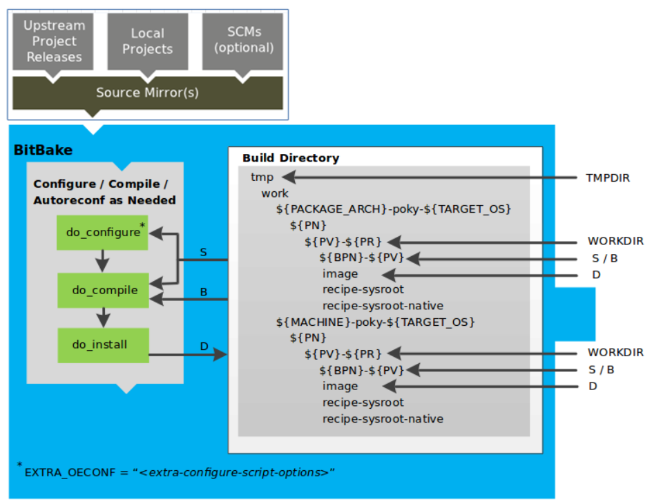
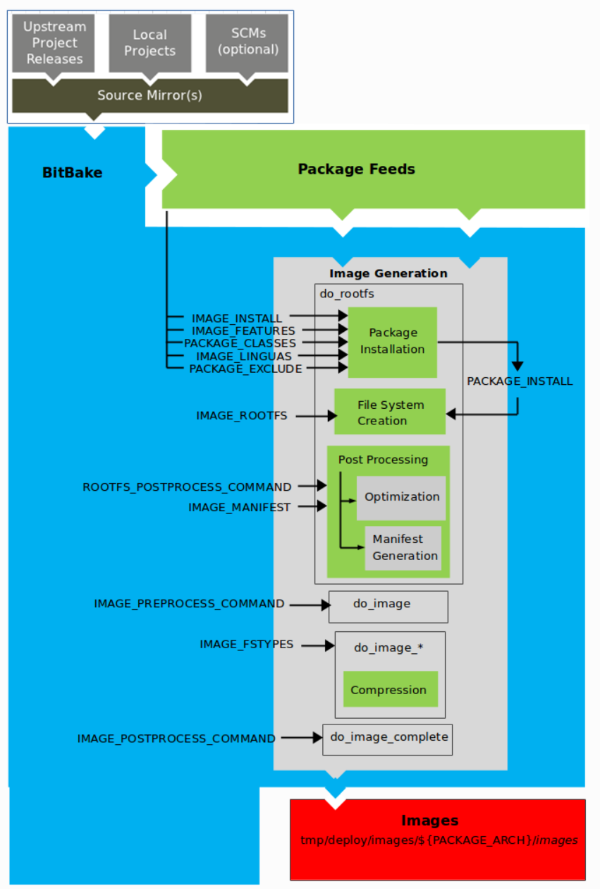

# Yocto与OpenBmc开发相关介绍

## Yocto介绍

**YOCTO它不是一个嵌入式LINUX发行版， 它可以为您创建了一个自定义Linux发行版**。

Yocto项目是一个开源协作项目，帮助开发人员为嵌入式产品*创建自定义的Linux的系统*，而不管硬件架构如何。该项目提供了一套灵活的工具和空间，全球嵌入式开发人员可以在其中共享技术、软件、配置和最佳实践，这些技术、软件、配置和最佳实践可用于为嵌入式设备创建定制的Linux映像。

该项目提供了提供硬件支持和软件的标准，允许软件配置和构建的交换。这些工具允许用户以可维护和可扩展的方式构建和支持多个硬件平台和软件堆栈的定制。

从历史上看，这个项目是从OpenEmbedded项目发展而来的，OpenEmbedded项目是构建系统和一些元数据的来源。


### Yocto总体工作流

通常，Yocto构建的工作流由以下几个功能区域组成：

- **User Configuration：**可用于控制生成过程的元数据（包含配置文件，配方文件）。
- **Metadata Layers：**提供软件、机器和发行版元数据的各种层。
- **Source Files：**上游版本、本地项目和 SCM。
- **Build System：**[BitBake](https://docs.yoctoproject.org/ref-manual/terms.html#term-BitBake)控制下的进程。此块扩展了 BitBake 如何获取源代码、应用修补程序、完成编译、分析输出以生成包、创建和测试包、生成映像以及生成交叉开发工具。
- **Package Feeds：**包含输出包（RPM、DEB 或 IPK）的目录，这些目录里的包随后用于生成的系统镜像或软件开发工具包 （SDK）。如果启用了运行时包管理，还可以使用 Web 服务器或其他方式复制和共享这些包，以便于在运行时扩展或更新设备上的现有映像。
- **Images：**生成的固件镜像。
- **Application Development SDK：**与镜像一起生成或与 BitBake 单独生成的交叉开发工具。


1. 开发人员指定体系结构、策略、补丁程序和配置的详细信息。
2. 构建系统从指定位置提取并下载源代码。构建系统支持标准方法（如压缩包）或源代码存储库系统（如 Git）。
3. 下载源代码后，构建系统会将源代码提取到本地工作区中，并在其中应用修补程序并运行配置和编译软件的常见步骤。
4. 然后，构建系统将软件安装到临时暂存区域中，在该区域中，您选择的二进制包格式（DEB、RPM 或 IPK）用于汇总软件。
5. 不同的 QA 和健全性检查贯穿整个构建过程。
6. 创建二进制文件后，构建系统将文件打包成一个二进制程序包，该包用于创建最终的根文件系统镜像。
7. 构建系统生成文件系统映像和自定义的可扩展 SDK （eSDK），以便并行进行应用程序开发。


### Yocto项目中基本概念介绍

- **Configuration Files：**保存变量、用户定义变量和硬件配置信息的全局定义的文件。这些文件告诉构建系统要构建什么，以及要放入镜像中的内容以支持特定平台。**.conf**后缀的文件为配置文件，这些文件通常分为几个区域，这些区域定义机器配置选项、分发配置选项、编译器调整选项、常规通用配置选项和用户配置选项。

- **Recipe：**最常见的元数据形式。配方包含用于构建包的配置和任务列表，然后用于构建二进制镜像。配方描述了您从何处获取源代码以及要应用的补丁程序。配方描述库或其他配方的依赖关系以及配置和编译选项。相关配方被合并到一个层中。后缀为**.bb**或**.bbappend**文件为配方文件。

- **Classes：**后缀为**.bbclass**为类文件，类文件是在recipes之间共享的公共功能。 当recipes继承一个类时，它们将继承该类的配置和功能。

- ***Layer**：*相关配方的集合。层允许您整合相关元数据用于自定义构建，并隔离多个架构构建的信息。层是分层的，图层可以随时包含对先前说明或设置的更改。这种强大的覆盖功能允许您自定义以前提供的层或社区层，以满足您的产品要求。您可以从Yocto项目中包含任意数量的可用层，并通过在它们之后添加您的层来定制构建。层索引（bblayers.conf）可以在Yocto项目中搜索层。**层模型是yocto定制的关键**，有关图层的更多详细信息，请参阅 Yocto 项目开发任务手册中的“[了解和创建图层](https://docs.yoctoproject.org/dev-manual/common-tasks.html#understanding-and-creating-layers)”部分。

- **Metadata：**Yocto 项目的一个关键元素是元数据，它用于构建 Linux 发行版，并包含在 OpenEmbedded 构建系统在构建映像时解析的文件中。通常，元数据包括配方、配置文件和引用构建说明本身的其他信息，以及用于控制构建内容和构建效果的数据。元数据还包括用于指示使用什么版本的软件、从何处获取它们的命令和数据，以及对软件本身的更改或添加（修补程序或辅助文件），这些更改或添加用于修复错误或自定义软件以在特定情况下使用。OpenEmbedded-Core是一组重要的经过验证的元数据。

- **OpenEmbedded-Core：**OE-Core是由基础配方，类和相关文件组成的元数据，这些公式，类和关联文件意味着在许多不同的OpenEmbedded派生系统（包括Yocto项目）中通用。OE-Core是由OpenEmbedded社区开发的原始存储库的精选子集，该存储库已被缩减为一组较小的核心持续验证配方。结果是一套严格控制和质量保证的核心配方。

- **Packages：**包通常是通过配方生成的已编译二进制文件。例如，Yocto 项目参考手册的“[构建主机所需的包](https://docs.yoctoproject.org/ref-manual/system-requirements.html#required-packages-for-the-build-host)”部分中提到的包是编译的二进制文件，安装后，这些二进制文件会向主机 Linux 发行版添加功能。另一点值得注意的是，从历史上看，在Yocto项目中，配方被称为包 - 因此，存在几个似乎被错误命名的BitBake变量（例如[PR](https://docs.yoctoproject.org/ref-manual/variables.html#term-PR)，[PV](https://docs.yoctoproject.org/ref-manual/variables.html#term-PV)和[PE](https://docs.yoctoproject.org/ref-manual/variables.html#term-PE)）。

- **Image**: 一种二进制形式的Linux发行版(操作系统)，用于加载到设备上。

- **Build System - "Bitbake"：**BitBake是一个任务调度程序和执行引擎，用于解析指令（即配方）和配置数据。解析阶段过后，BitBake 会创建一个依赖关系树来对编译进行排序，计划所包含代码的编译，最后执行指定自定义 Linux 映像的生成。BitBake类似于`make`在构建过程中，生成系统跟踪依赖项，并执行每个包的本机编译或交叉编译。作为交叉构建设置的第一步，框架尝试创建适合目标平台的交叉编译器工具链（即eSDK）。

- **Extensible Software Development Kit (ESDK)：**面向应用程序开发人员的自定义 SDK。此 eSDK 允许开发人员将其库和编程更改合并回映像，以便将其代码提供给其他应用程序开发人员。有关 eSDK 的信息，请参阅 [Yocto 项目应用程序开发和可扩展软件开发工具包 （eSDK）](https://docs.yoctoproject.org/sdk-manual/index.html) 手册。

- **Poky：**Poky 是一个参考嵌入式发行版和参考测试配置。Poky提供以下内容：

  - 用于说明如何自定义分发的基本级功能发行版。
  - 一种测试 Yocto 项目组件的方法（即 Poky 用于验证 Yocto 项目）。
  - 一种工具，您可以通过它下载Yocto项目。

  Poky不是产品级发行版。相反，它是自定义的良好起点。注意，Poky是OE-Core之上的集成层。
  
  
### Yocto系统构建过程介绍

下面详细的介绍下Yocto构建系统的构建过程。构建系统的核心任务执行器是bitbake。

1. **用户配置**

   用户配置帮助我们定义构建的过程，通过配置，我们可以告诉编译系统我们生成镜像的架构，源码从哪里下载和一些其他的编译属性。

   


2. 元数据、machine和distro配置

   

3. 源文件

   

4. Package Feed

   


## Openbmc介绍

### OpenBmc简化框架


### OpenBmc开发环境与构建

OpenBmc开可以使用我们公共的编译机，或者自己的虚机，公共的编译机ip地址是10.53.19.197

1. git配置
   git的全局配置（**配置为自己的gitlab账户的用户名和邮箱**）

   ```
   git config --global user.name "xxx"
   git config --global user.email "xxx.xx@luxshare-ict.com"
   git config --global credential.helper store
   ```

2. 获取openbmc代码

   克隆openbmc代码 `git clone -b lux-dev http://10.53.19.12/openbmc/openbmc.git `

   ```shell
   lyx@HZ-FS:~$ git clone -b lux-dev http://10.53.19.12/openbmc/openbmc.git
   Cloning into 'openbmc'...
   remote: Enumerating objects: 213201, done.
   remote: Counting objects: 100% (108/108), done.
   remote: Compressing objects: 100% (68/68), done.
   remote: Total 213201 (delta 36), reused 86 (delta 28), pack-reused 213093
   Receiving objects: 100% (213201/213201), 196.48 MiB | 3.51 MiB/s, done.
   Resolving deltas: 100% (134859/134859), done.
   Updating files: 100% (14836/14836), done.
   
   lyx@HZ-FS:~$ cd openbmc
   lyx@HZ-FS:~/openbmc$ git branch -a
   * lux-dev
     remotes/origin/HEAD -> origin/master
     remotes/origin/lux-dev
     remotes/origin/master
   
   lyx@HZ-FS:~/openbmc$ ls -lh
   total 117M
   lrwxrwxrwx  1 lyx bmc   13 Jun 27 22:58 bitbake -> poky/bitbake/
   drwxr-xr-x  5 lyx bmc 4.0K Jul 11 10:58 build
   lrwxrwxrwx  1 lyx bmc   12 Jun 27 22:58 LICENSE -> poky/LICENSE
   lrwxrwxrwx  1 lyx bmc    9 Jun 27 22:58 meta -> poky/meta
   drwxr-xr-x  6 lyx bmc 4.0K Jun 28 20:15 meta-amd
   drwxr-xr-x  5 lyx bmc 4.0K Jun 28 20:15 meta-ampere
   drwxr-xr-x  9 lyx bmc 4.0K Jun 28 20:15 meta-aspeed
   drwxr-xr-x  4 lyx bmc 4.0K Jun 28 20:15 meta-asrock
   drwxr-xr-x  8 lyx bmc 4.0K Jul  9 16:12 meta-bytedance
   drwxr-xr-x  6 lyx bmc 4.0K Jun 28 20:15 meta-evb
   drwxr-xr-x 12 lyx bmc 4.0K Jun 28 20:15 meta-facebook
   drwxr-xr-x  5 lyx bmc 4.0K Jun 28 20:15 meta-fii
   drwxr-xr-x 13 lyx bmc 4.0K Jun 28 20:15 meta-google
   drwxr-xr-x  7 lyx bmc 4.0K Jun 28 20:15 meta-hpe
   drwxr-xr-x 11 lyx bmc 4.0K Jun 28 20:15 meta-ibm
   drwxr-xr-x  4 lyx bmc 4.0K Jun 27 22:58 meta-ingrasys
   drwxr-xr-x  5 lyx bmc 4.0K Jun 28 20:15 meta-inspur
   drwxr-xr-x  5 lyx bmc 4.0K Jun 28 20:15 meta-intel-openbmc
   drwxr-xr-x  5 lyx bmc 4.0K Jun 28 20:15 meta-inventec
   drwxr-xr-x  8 lyx bmc 4.0K Jul 10 09:33 meta-luxshare
   drwxr-xr-x  6 lyx bmc 4.0K Jun 28 20:15 meta-nuvoton
   drwxr-xr-x 13 lyx bmc 4.0K Jun 27 22:58 meta-openembedded
   drwxr-xr-x  7 lyx bmc 4.0K Jun 28 20:15 meta-openpower
   drwxr-xr-x 18 lyx bmc 4.0K Jun 28 20:15 meta-phosphor
   lrwxrwxrwx  1 lyx bmc   15 Jun 27 22:58 meta-poky -> poky/meta-poky/
   drwxr-xr-x  3 lyx bmc 4.0K Jun 28 20:15 meta-qualcomm
   drwxr-xr-x 10 lyx bmc 4.0K Jun 28 20:15 meta-quanta
   drwxr-xr-x 19 lyx bmc 4.0K Jun 28 20:15 meta-raspberrypi
   drwxr-xr-x 23 lyx bmc 4.0K Jun 28 20:15 meta-security
   lrwxrwxrwx  1 lyx bmc   18 Jun 27 22:58 meta-skeleton -> poky/meta-skeleton
   drwxr-xr-x  5 lyx bmc 4.0K Jun 28 20:15 meta-supermicro
   drwxr-xr-x  6 lyx bmc 4.0K Jun 28 20:15 meta-tyan
   drwxr-xr-x  5 lyx bmc 4.0K Jun 28 20:15 meta-wistron
   drwxr-xr-x  8 lyx bmc 4.0K Jun 28 20:15 meta-yadro
   -rw-r--r--  1 lyx bmc  32M Jul 15 21:23 obmc-phosphor-image-evb-ast2500-20220713080538.static.mtd
   lrwxrwxrwx  1 lyx bmc   22 Jun 27 22:58 oe-init-build-env -> poky/oe-init-build-env
   -rw-r--r--  1 lyx bmc  436 Jun 27 22:58 openbmc-env
   -rw-r--r--  1 lyx bmc  104 Jun 27 22:58 OWNERS
   drwxr-xr-x 11 lyx bmc 4.0K Jun 28 20:15 poky
   -rw-r--r--  1 lyx bmc  722 Jul 15 21:23 qemu-bmc.sh
   -rwxr-xr-x  1 lyx bmc  85M Jul 15 21:23 qemu-system-arm
   -rw-r--r--  1 lyx bmc 6.0K Jun 28 20:15 README.md
   lrwxrwxrwx  1 lyx bmc   13 Jun 27 22:58 scripts -> poky/scripts/
   -rwxr-xr-x  1 lyx bmc 3.2K Jun 28 20:15 setup
   ```


3. openbmc 编译环境准备配置

   在openbmc 源码目录执行如下命令进行编译前环境变量准备

   ```shell
   lyx@HZ-FS:~/openbmc$ source setup palos
   Machine palos found in meta-luxshare/meta-palos
   Common targets are:
        obmc-phosphor-image
   lyx@HZ-FS:~/openbmc/build/palos$
   ```

   

   如果之前已编译过，已有build/palos的目录的情况下，执行如下命令配置环境变量

   ```shell
   lyx@HZ-FS:~/openbmc$ . oe-init-build-env build/palos/
   Common targets are:
        obmc-phosphor-image
   lyx@HZ-FS:~/openbmc/build/palos$
   ```

   

   拷贝downloads和sstate-cache到编译目录，downloads可以省去去上游社区下载的过程，sstate-cache是之前编译ok的缓存，可以加速本次的编译过程
   这个两个文件在10.53.19.197的/home/openbmc/backup/下面有备份，需要拷贝过来解压到编译到自己的openbmc构建环境的`./build/palos/`下面

   ```shell
   tar -xvf /home/openbmc/backup/download.tar.gz ./build/palos/
   tar -xvf /home/openbmc/backup/sstate-cache.tar.gz ./build/palos/
   chmod 777 -R ./build/palos/downloads
   chmod 777 -R ./build/palos/sstate-cache
   ```

   或者修改conf 文件中的
   DL_DIR: 上游社区下载源代码的缓存目录
   SSTATE_DIR: 构建过程中生成文件的缓存目录
   ```shell
   DL_DIR ?= "/home/lyx/downloads/"
   SSTATE_DIR ?= "/home/lyx/sstate-cache/"
   ```

3. 构建openbmc镜像

   执行`bitbake obmc-phosphor-image` 命令进行镜像构建

   构建成功之后，生成的bmc image 文件在`build/tmp/deploy/images/palos/` 目录

   ```
   lyx@HZ-FS:~/openbmc/build/palos$ ls -1 tmp/deploy/images/palos/
   aspeed-bmc-luxshare-palos--5.15.50+git0+27b1fcc034-r0-palos-20220718061734.dtb
   aspeed-bmc-luxshare-palos.dtb
   aspeed-bmc-luxshare-palos-palos.dtb
   fitImage
   fitImage--5.15.50+git0+27b1fcc034-r0-palos-20220718061734.bin
   fitImage-its--5.15.50+git0+27b1fcc034-r0-palos-20220718061734.its
   fitImage-its-obmc-phosphor-initramfs-palos--5.15.50+git0+27b1fcc034-r0-palos-20220718061734.its
   fitImage-its-obmc-phosphor-initramfs-palos-palos
   fitImage-its-palos
   fitImage-linux.bin--5.15.50+git0+27b1fcc034-r0-palos-20220718061734.bin
   fitImage-linux.bin-palos
   fitImage-obmc-phosphor-initramfs-palos--5.15.50+git0+27b1fcc034-r0-palos-20220718061734.bin
   fitImage-obmc-phosphor-initramfs-palos-palos
   fitImage-palos.bin
   flash-palos
   image-bmc
   image-kernel
   image-rofs
   image-rwfs
   image-u-boot
   obmc-phosphor-image-palos-20220715133736.rootfs.manifest
   obmc-phosphor-image-palos-20220715133736.rootfs.squashfs-xz
   obmc-phosphor-image-palos-20220715133736.static.mtd
   obmc-phosphor-image-palos-20220715133736.static.mtd.all.tar
   obmc-phosphor-image-palos-20220715133736.static.mtd.tar
   obmc-phosphor-image-palos-20220715133736.testdata.json
   obmc-phosphor-image-palos.jffs2
   obmc-phosphor-image-palos.manifest
   obmc-phosphor-image-palos.squashfs-xz
   obmc-phosphor-image-palos.static.mtd
   obmc-phosphor-image-palos.static.mtd.all.tar
   obmc-phosphor-image-palos.static.mtd.tar
   obmc-phosphor-image-palos.testdata.json
   obmc-phosphor-initramfs-palos-20220715133736.rootfs.cpio.xz
   obmc-phosphor-initramfs-palos-20220715133736.rootfs.manifest
   obmc-phosphor-initramfs-palos-20220715133736.testdata.json
   obmc-phosphor-initramfs-palos.cpio.xz
   obmc-phosphor-initramfs-palos.manifest
   obmc-phosphor-initramfs-palos.testdata.json
   palos-20220715133736.all.tar
   palos-20220715133736.tar
   u-boot.bin
   u-boot-palos.bin
   u-boot-palos-v2019.04+gitAUTOINC+6ca27db3f9-r0.bin
   vmlinux
   vmlinux--5.15.50+git0+27b1fcc034-r0-palos-20220718061734.bin
   vmlinux-palos.bin
   ```

   

4. 仿真构建ok的openbmc镜像
   启动openbmc仿真进行的脚本为`start-qemu-bmc.sh`

   ```shell
   lyx@HZ-FS:~/openbmc$ ./start-qemu-bmc.sh -h
   Usage:
    ./start-qemu-bmc.sh <image> <machine>
   Example:
    ./start-qemu-bmc.sh                      Start qemu use default image
    ./start-qemu-bmc.sh xxx.mtd              Start qemu use specify image
    ./start-qemu-bmc.sh xxx.mtd ast2500-evb  Start qemu use specify image and machine
   ```

   

   当启动时出现如下提示，表示同一台机器上已经有其他人启动的qemu，占用了2443的port，可以根据提示输入其他的数字，绑定另外的端口启动

   ```shell
   lyx@HZ-FS:~/openbmc$ ./start-qemu-bmc.sh
   Info: check image...
   Info: image is ./build/palos/tmp/deploy/images/palos/image-bmc
   Info: Machine is g220a-bmc
   Info: bind ip is 10.53.19.197
   (Not all processes could be identified, non-owned process info
    will not be shown, you would have to be root to see it all.)
   Warning: Tcp port 2443 is in use, Please select another port to use
   input 3-9:
   ```

   

5. SDK的安装和使用

   对于一些系统下的应用软件的调试，可以通过SDK来交叉编译，生成对应的程序后拷贝到目标板进行调试验证其功能

   SDK已经安装编译机的`/home/opembmc/workspace/obmc-sdk` 目录下

   可以执行如下命令进行环境变量配置

   `source /home/openbmc/workspace/obmc-sdk/environment-setup-arm1176jzs-openbmc-linux-gnueabi`

   进行编译时使用`$CC`或`$CPP`


3. 新建一个配方

   在对应层的目录下新建配方名称的目录

   配方的框架如下，填入对应的内容，或参考其他已有配方的内容

   ```
   DESCRIPTION = ""   		#配方的描述信息
   HOMEPAGE = ""			#配方的介绍
   LICENSE = ""			#配方源码的license
   SECTION = ""			#
   DEPENDS = ""			#配方的依赖，可以有多个，以空格分开
   LIC_FILES_CHKSUM = ""	#配方license文件及md5校验
   SRC_URI = ""			#配方的源码路径
   SRCREV = ""				#配方的版本
   ```


## bitbake工具使用介绍

BitBake是Yocto项目的核心组件，由OpenEmbedded构建系统用于构建映像。虽然BitBake是构建系统的关键，但BitBake与Yocto项目分开维护。

BitBake 是一个通用任务执行引擎，它允许 shell 和 Python 任务高效并行运行，同时在复杂的任务间依赖关系约束内工作。简而言之，BitBake是一个构建引擎，它通过以特定格式编写的配方来执行任务集。

### bitbake 构建流程


1. 获取和提取源代码

   

   获取和提取源代码到build的目录，构建过程中产生的所东西都在build目录下面。

   对于配方文件中的所有SRC_URI中的本地文件（即file://指定文件），构建中通过检验文件的校验和来检测文件是否有变化，如果有变化回重新执行do_fetch来更新到build目录。

   **TMPDIR:** 构建过程中的基本目录，所有构建过程都是在此目录下，默认是build目录下的tmp目录

   **PACKAGE_ARCH:** 构建包的架构，根据生成包所应用的地方会有所不同

   **TARGET_OS:** 目标设备的操作系统，一般都是linux或xxx-linux

   **PN:** 构建包的名称，一般是包对应配方的名称

   **WORK_DIR:** 工作目录，构建配方的目录，(**PV:** 配方的版本， **PR:** 配方的小版本） 

   **S:** 源代码放置的目录（**BPN:** 配方生成包的名称PN去掉部分内容，**PV:** 用于构建包的配方的版本）

   

2. 补丁 – 应用补丁进行错误修复和新功能

   

   

3. 配置，编译和安装

   

   

4. 打包 - 生成安装包

   

5. 固件生成

   


### bitbake 常用命令

**`bitbake [options] [recipename/target recipe:do_task ...]`**  构建固件相关命令

```shell
bitbake -s 列出所有的配方和其版本
bitbake -e [recipe name] 列出配方所有的环境变量和器构建的过程
bitbake [recipe name] 构建对应的配方
bitbake [recipe name] -c listtasks  列出配方对应的任务
bitbake -g [recipe name]  列出配方的依赖
bitbake -g -u taskexp [recipe name]  图形方式显示依赖
```


**` bitbake-layers [-d] [-q] [-F] [--color COLOR] [-h] <subcommand> ...`** 层相关的命令

```shell
bitbake-layers show-layers  显示当前所使用的layer
bitbake-layers show-recipes  显示每个layer提供的配方
bitbake-layers show-appends [recipe name] 显示所有layer提供的append文件,或显示对应配方的append文件
bitbake-layers add-layers  添加一个层
bitbake-layers remove-layers  删除一个层
```


## devtool工具使用介绍

devtool提供了很多功能，可以帮助我们构建/测试和打包软件。该命令也是eSDK的关键部分。

```shell
$ devtool -h
NOTE: Starting bitbake server...
usage: devtool [--basepath BASEPATH] [--bbpath BBPATH] [-d] [-q] [--color COLOR] [-h] <subcommand> ...

OpenEmbedded development tool

options:
  --basepath BASEPATH   Base directory of SDK / build directory
  --bbpath BBPATH       Explicitly specify the BBPATH, rather than getting it from the metadata
  -d, --debug           Enable debug output
  -q, --quiet           Print only errors
  --color COLOR         Colorize output (where COLOR is auto, always, never)
  -h, --help            show this help message and exit

subcommands:
  Beginning work on a recipe:
    add                   Add a new recipe
    modify                Modify the source for an existing recipe
    upgrade               Upgrade an existing recipe
  Getting information:
    status                Show workspace status
    latest-version        Report the latest version of an existing recipe
    check-upgrade-status  Report upgradability for multiple (or all) recipes
    search                Search available recipes
  Working on a recipe in the workspace:
    build                 Build a recipe
    rename                Rename a recipe file in the workspace
    edit-recipe           Edit a recipe file
    find-recipe           Find a recipe file
    configure-help        Get help on configure script options
    update-recipe         Apply changes from external source tree to recipe
    reset                 Remove a recipe from your workspace
    finish                Finish working on a recipe in your workspace
  Testing changes on target:
    deploy-target         Deploy recipe output files to live target machine
    undeploy-target       Undeploy recipe output files in live target machine
    build-image           Build image including workspace recipe packages
  Advanced:
    create-workspace      Set up workspace in an alternative location
    extract               Extract the source for an existing recipe
    sync                  Synchronize the source tree for an existing recipe
    menuconfig            Alter build-time configuration for a recipe
    import                Import exported tar archive into workspace
    export                Export workspace into a tar archive
  other:
    selftest-reverse      Reverse value (for selftest)
    pluginfile            Print the filename of this plugin
    bbdir                 Print the BBPATH directory of this plugin
    count                 How many times have this plugin been registered.
    multiloaded           How many times have this plugin been initialized
Use devtool <subcommand> --help to get help on a specific command
```


### devtool常用命令

```shell
devtool modify [recipe name]  导出源码到workspace目录，然后进行一些修改

devtool  finish [recipe name]  [layer]  将修改同步到对应的层

devtool  reset [recipe name]   放弃workspace 下的修改

devtool build [recipe name]  构建对应的配方

devtool search [recipe name]  查询对应的配方

devtool edit-recipe [recipe name]  修改配方文件

devtool find-recipe [recipe name]  查询配方文件

devtool update-recipe [recipe name]   更新修改

devtool deploy-target [recipe name] [root@x.x.x.x]  部署配方生成文件到目标机器
```


## git常用命令

- 全局配置命令
配置全局用户名：`git config --global user.name "xxx"`
配置全局邮箱：`git config --global user.email "xx.xx@luxshare-ict.com"`
存储用户名和密码：`git config --global credential.helper store`

- 远端仓库配置命令
添加远端仓库：`git remote add <name> <url>`
删除远端仓库：`git remote remove <name>`
重命名远端仓库：`git remote rename <old> <new>`
显示远端仓库信息：`git remote -v`

- 文件操作命令
创建一个空仓库：`git init`
从远端克隆一个仓库：`git clone <url>`
同步远端仓库到本地仓库：`git pull`
rebase方式同步：`git pull --rebase` 
注：当本地有新的提交记录，远端仓库也有别人新的提交时，可以使用rebase方式同步远端，保证分支较为干净，不会产生mega的记录，最好实在每次本地commit前git pull一下同步远端
同步本地仓库到远端：`git push`
创建一个分支：`git branch <name>`
查看所有分支：`git branch -a`
切换分支：`git checkout -b <br name>`
查看当前本地仓库状态：`git status`
添加修改的文件到暂存区：`git add <filename>` 或`git add .`添加所有文件
提交修改：`git commit -m "xxxx"`  xxx是本次提交修改点说明
取消文件暂存：`git reset HEAD [filename]`
回退上一次的提交：`git reset [--hard/--soft/--mixed] HEAD^`

- 历史查询与patch生成
查看提交历史：`git log`
查看修改文件信息：`git log --summary`
查看工作目录与上次提交的差异：`git diff HEAD`
将上次提交生成patch文件：`git format-patch HEAD^`
注：^的数量表示指定前几次的提交生成patch记录


